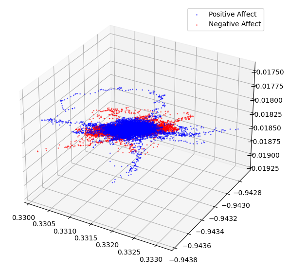

# GSoC 2026 | ML4SCI: NeuroDyads Pre-task Solution
## Decoding Inter-Brain Manifolds of Conversational Affect

This repository contains the technical implementation and scientific report for the **NeuroDyads** pre-task for the Google Summer of Code 2026 application.

---

### 📌 Project Overview
The objective of this task is to decode emotional affect (positive vs. negative) from 128-channel dyadic EEG data recorded during human-to-human conversation. The pipeline utilizes **Independent Component Analysis (ICA)** for artifact suppression and **CEBRA**, a contrastive learning framework, to isolate affect-specific neural manifolds.

### 🛠️ Technical Pipeline
1. **Preprocessing & Artifact Removal (ICA):** - Applied band-pass filtering (1–40 Hz).
   - Utilized ICA to isolate and reject non-neural physiological noise (Ocular blinks and Myogenic muscle interference).
   - Validated cleaning via Power Spectral Density (PSD) analysis, ensuring the preservation of cortical Alpha rhythms (~10 Hz).
2. **Manifold Learning (CEBRA):** - Projected high-dimensional EEG signals into a **3D latent space**.
   - Optimized InfoNCE loss over 2,000 iterations to identify divergent neural trajectories.
3. **Decoding & Statistical Validation:** - Evaluated the embedding using a **5-neighbor k-NN decoder**.
   - Benchmarked against a **shuffled-label control model** to ensure results significantly exceed chance levels.

### 📊 Key Results
| Metric | Main Model | Control (Shuffled) |
| :--- | :--- | :--- |
| **k-NN Decoding Accuracy** | **59.29%** | **49.43%** |
| **Accuracy Gain** | **~10%** | **Baseline** |

> **Interpretation:** The ~10% gain over the control baseline validates that the CEBRA model successfully learned affect-specific features rather than stochastic noise.

---

### 📈 Visualizations

#### Power Spectral Density (PSD) Analysis

*Figure 1: PSD analysis confirming the dampening of low-frequency ocular artifacts and high-frequency myogenic noise while maintaining the integrity of the Alpha peak.*

#### 3D Neural Manifolds

  
   

*Figure 2: Latent 3D projections showing divergent neural trajectories for Positive vs. Negative affect states.*

---

### 📂 Repository Structure
* `neurodyads_pretask.ipynb`: Full implementation notebook (ICA, CEBRA, k-NN).
* `requirements.txt`: Environment dependencies.
* `README.md`: Project documentation and candidate profile.

### 👤 Candidate Profile: Shambhavi Sinha
I am a 19-year-old 2nd-year B.Tech CSE student with a focus on the intersection of Software Engineering and Medical AI.

#### Technical Highlights:
* **VitalChain (Lead Developer):** Architected an offline-first mesh network for rural healthcare alerts, ensuring connectivity in infrastructure-less environments.
* **IEEE AESS Hackathon (2nd Place):** Developed an autonomous multi-agent traffic coordination system using CNNs and scalable logic for aerospace applications.
* **ISL Translator:** Built a computer vision tool to translate Indian Sign Language into text.
* **AWS Cloud Club:** Serving as a Design Associate, bridging the gap between cloud architecture and UI/UX.
